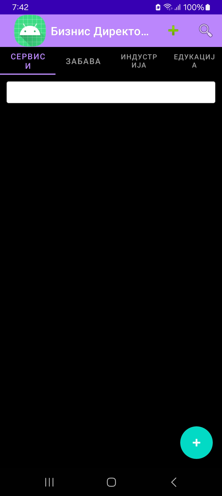
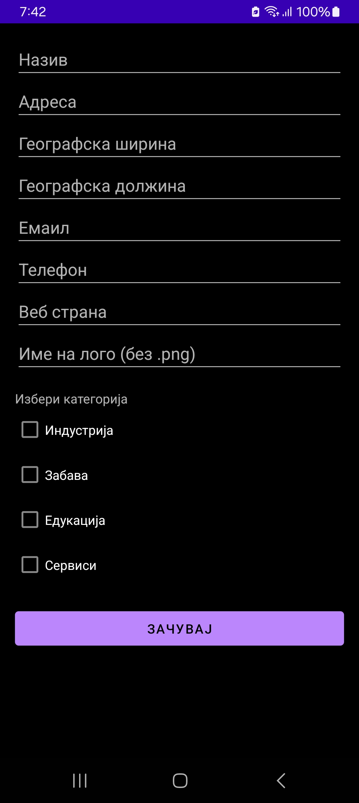
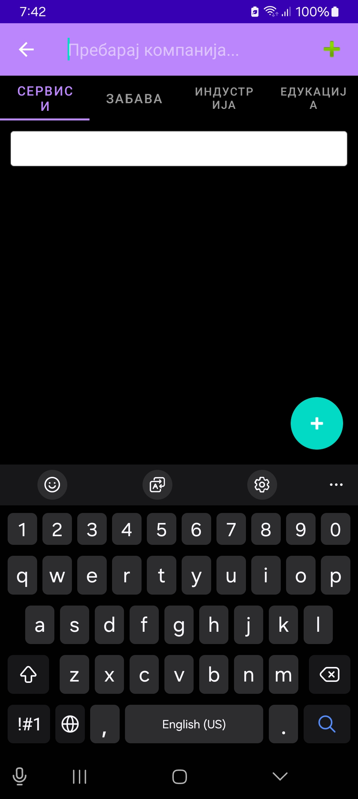
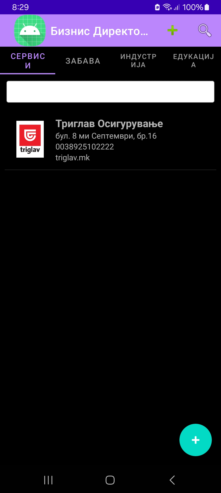
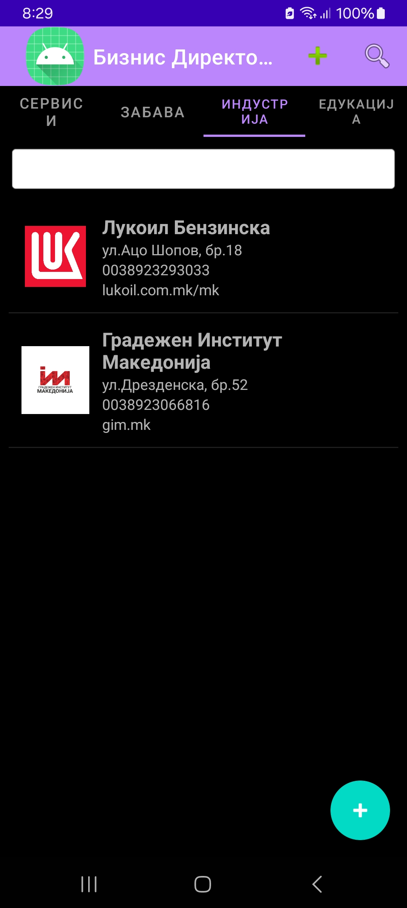
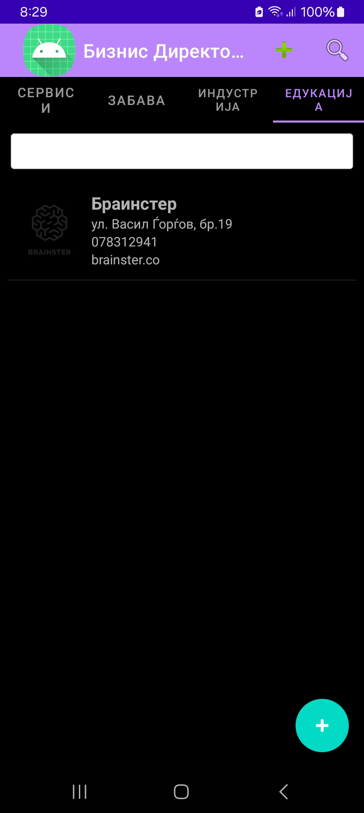
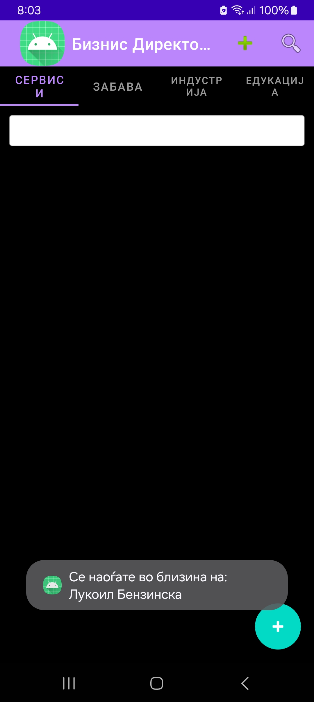

# BusinessDirectoryApp

📱 **Android Mobile Application – Business Directory**

This application was developed as a **master's project** for the subject 
**“Development of Applications for Mobile and Embedded Devices”**

The goal of this project is to demonstrate knowledge and skills in:
- Designing intuitive user interfaces for mobile devices
- Managing and displaying structured business data
- Implementing remote data storage and retrieval via web services
- Using local storage for offline access
- Integrating location-based services
- Following best practices in mobile development using Java and Android Studio


## ✨ Application Overview

The BusinessDirectoryApp is a modern Android application that functions as a **business directory**, allowing users to browse and register companies grouped into four categories:

- 🏭 Industry  
- 🎭 Entertainment  
- 🎓 Education  
- 🛠️ Services


## 🧩 Key Features

- 🔹 **Material Design UI** with TabLayout and custom icons  
- 🔹 **Add new companies** via a form (name, address, geolocation, contact, category selection)
- 🔹 **Multiple category selection** via checkboxes (supports multi-category classification)
- 🔹 **Data saving to Firebase** (remote database) and **ObjectBox** (local storage)
- 🔹 **Company list filtered per tab/category**, with ListView displaying:
  - Logo
  - Company name
  - Address
  - Phone number
  - Website link
- 🔹 **Search bar** that filters companies by name within the current category
- 🔹 **Real-time location tracking** – shows a toast message if a company is within 5000 meters of the user

---

## 💡 Technical Stack

| Technology           | Purpose                                |
|----------------------|----------------------------------------|
| Android Studio (Java) | Application development environment   |
| Firebase Realtime DB | Remote database (cloud storage)        |
| ObjectBox            | Local database for offline persistence |
| Retrofit             | Communication with web services        |
| Google Location API  | Accessing device location              |
| XML / Material Design| UI Layouts and styling                |

---

## 📸 Screenshots

> 📍 *Preview how the application looks in action*

| Main Screen (Tabs) | Add Company Form | Company List |
|--------------------|------------------|--------------|
|  |  |  |


### 🗂️ Category Tabs

| Services Tab | Industry Tab | Entertainment Tab |
|--------------|--------------|-------------------|
|  |  |  |

| Education Tab | Nearby Location Notification |
|----------------|------------------------------|
|  |  |

## 🎥 Demo Video

🔗 [Click here to watch the demo video](PUT_YOUR_LINK_HERE)

---

## 🚀 How to Run the App

To try the app on your own machine:

1. Clone the repository:
   ```bash
   git clone https://github.com/YOUR_USERNAME/BusinessDirectoryApp.git


