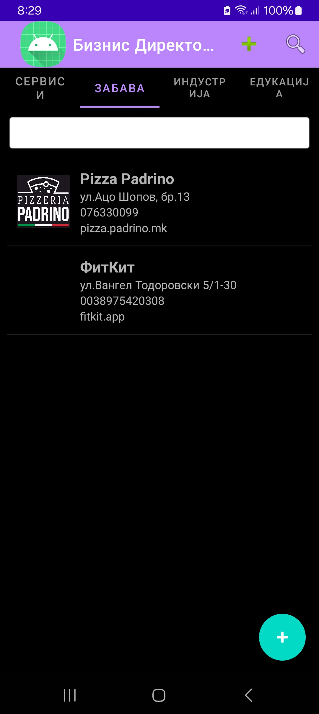

# BusinessDirectoryApp

## 📝 What is BusinessDirectoryApp?

**BusinessDirectoryApp** is a mobile Android application designed as a simple yet powerful **business directory tool**. It enables users to:

- **Discover local businesses** based on predefined categories
- **Register new companies** with detailed information including name, address, contact details, and geolocation
- **Search for companies** by name within specific categories
- **Get real-time proximity alerts** when a business is located within 50 meters of the user

This app is ideal for:
- Individuals looking to find local services or educational centers
- Small business owners who want to be included in a categorized listing
- Students and developers learning how to build mobile apps with features like Firebase integration, local storage (ObjectBox), and geolocation using Java and Android Studio

📱 **Android Mobile Application – Business Directory**

This application was developed as a **master's project** for the subject  
**“Development of Applications for Mobile and Embedded Devices”**  

The goal of this project is to demonstrate knowledge and skills in:
- Designing intuitive user interfaces for mobile devices
- Managing and displaying structured business data
- Implementing remote data storage and retrieval via web services
- Using local storage for offline access
- Integrating location-based services
- Following best practices in mobile development using Java and Android Studio

---

## ✨ Application Overview

The **BusinessDirectoryApp** is a modern Android application that functions as a **business directory**, allowing users to browse and register companies grouped into four categories:

- 🏭 Industry  
- 🎭 Entertainment  
- 🎓 Education  
- 🛠️ Services

---

## 🧩 Key Features

- 🔹 **Material Design UI** with TabLayout and custom icons  
- 🔹 **Add new companies** via a form (name, address, geolocation, contact, category selection)
- 🔹 **Multiple category selection** via checkboxes (supports multi-category classification)
- 🔹 **Data saving to Firebase** (remote database) and **ObjectBox** (local storage)
- 🔹 **Company list filtered per tab/category**, with ListView displaying:
  - Logo
  - Company name
  - Address
  - Phone number
  - Website link
- 🔹 **Search bar** that filters companies by name within the current category
- 🔹 **Real-time location tracking** – shows a toast message if a company is within **50 meters** of the user

---

## 💡 Technical Stack

| Technology           | Purpose                                |
|----------------------|----------------------------------------|
| Android Studio (Java) | Application development environment   |
| Firebase Realtime DB | Remote database (cloud storage)        |
| ObjectBox            | Local database for offline persistence |
| Retrofit             | Communication with web services        |
| Google Location API  | Accessing device location              |
| XML / Material Design| UI Layouts and styling                 |

---

## 📸 Screenshots

> 📍 *Preview of how the application looks in action*

### 📂 General Interface

| Main Screen (Tabs) | Add Company Form | Company List |
|--------------------|------------------|--------------|
|  |  |  |

### 🗂️ Category Tabs

| Services Tab | Industry Tab | Entertainment Tab |
|--------------|--------------|-------------------|
|  |  |  |

| Education Tab | Nearby Location Notification |
|----------------|------------------------------|
|  |  |

---

## 🎥 Demo Video

Watch a short demonstration of the application in action:

👉 [Click here to watch the demo video](https://github.com/Ivana-Gerchakova/BusinessDirectoryApp/raw/main/Demo%20video-app.mp4)

---

## 📥 Full Project Download

Due to file size limitations, the full Android Studio project cannot be hosted directly on GitHub.

🔗 **Download the complete project folder from Google Drive**:  
👉 [BusinessDirectoryApp – Google Drive](https://drive.google.com/drive/folders/1reKHHIo1iXXYCjvpuOX-Zwud41_V6gb1?usp=sharing)

This includes:
- Complete source code
- Project resources
- Demo video and screenshots

---

## 🚀 How to Run the App

To try the app locally:

1. Download the project folder from Google Drive:  
   👉 [BusinessDirectoryApp – Google Drive](https://drive.google.com/drive/folders/1reKHHIo1iXXYCjvpuOX-Zwud41_V6gb1?usp=sharing)

2. Unzip and open the project in Android Studio.

3. Make sure to:
   - Sync Gradle
   - Enable Internet and Location permissions in your device/emulator
   - Include your own `google-services.json` file in the `/app` directory (if needed)

4. Run the application on a real device or emulator.

